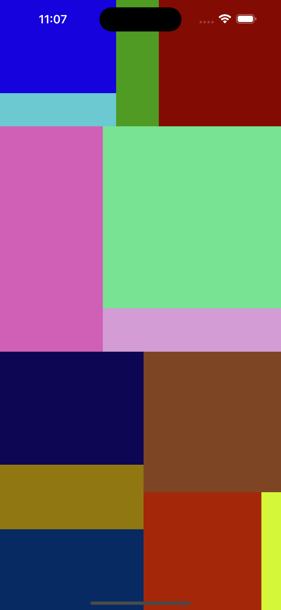

# TreeChartRenderer



The `TreeChartRenderer` class allows you to visualize an array of integers as a proportional tree chart within a UIView. Each subview within the tree chart represents an integer, with its area proportional to the integer's value. The views are recursively split and color-coded for visual differentiation.

## Features
- **Proportional Areas**: Each subview's area corresponds to the value of an integer, representing data proportionally.
- **Recursive Partitioning**: Dynamically partitions the data into visually balanced segments.
- **Color Coding**: Randomly color-codes subviews for better visual distinction.

## Requirements
- iOS 13.0+
- Xcode 11+
- Swift 5.3+

## Installation
Clone or download the repository and include the `TreeChartRenderer.swift` file in your Xcode project.

## Usage
To use the `TreeChartRenderer`, simply initialize it and call the `renderTreeChartIn` method with the desired parameters:

```swift
import UIKit

class ViewController: UIViewController {
    override func viewDidLoad() {
        super.viewDidLoad()
        let values = [3, 10, 15, 20, 25, 30, 12, 21, 7, 5, 14, 18, 42]  // Example data set
        TreeChartRenderer.renderTreeChartIn(self.view, array: values, rect: self.view.bounds)
    }
}

